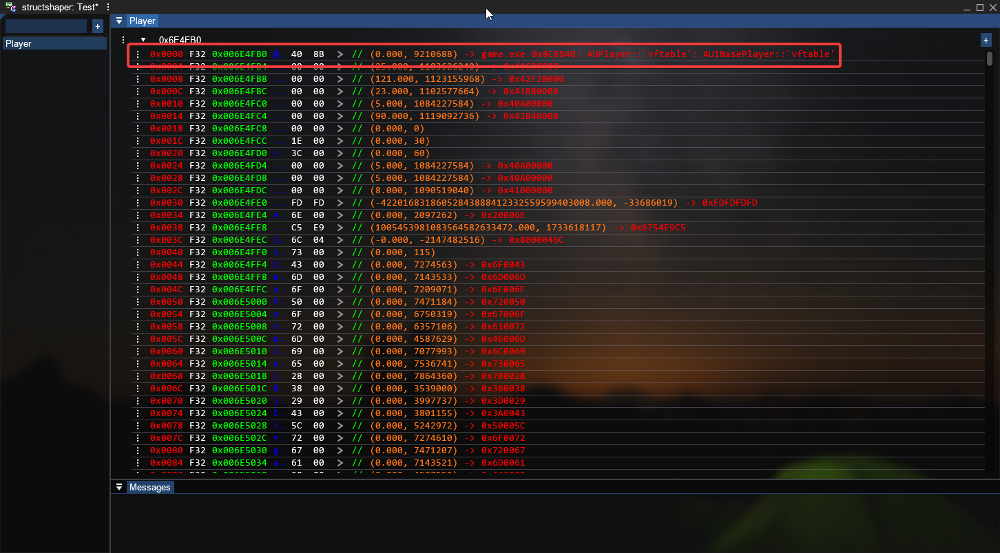
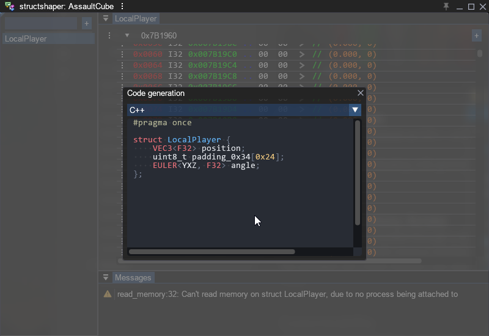
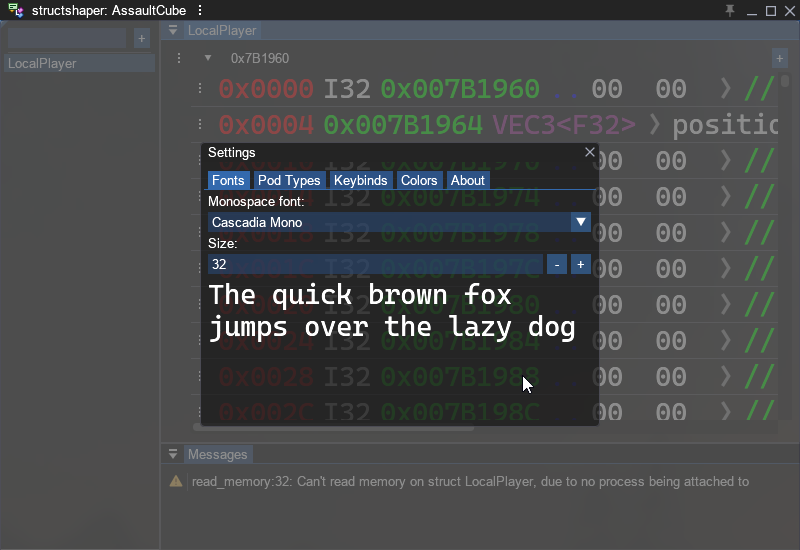
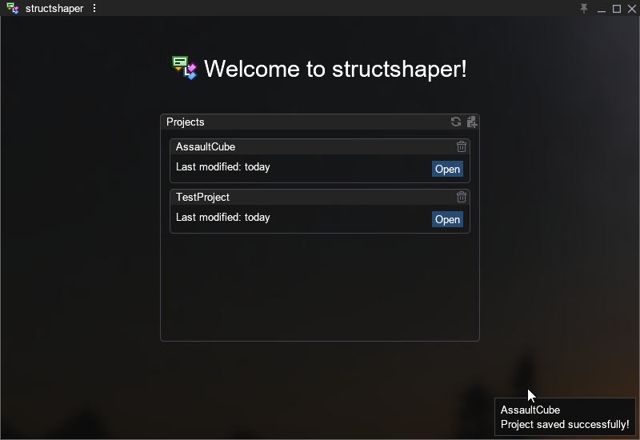

# structshaper

structshaper is a cross-platform tool for reverse engineering memory structures of running programs.
It allows you to attach to a process, specify an address, view raw data, and define data types.
You can then export the results as C/C++ or Rust code for interfacing with the process.

A typical workflow might be as following:
1. Attach to a process.
2. Enter an address.
3. Define data types.
4. Export the code.

## Features

### RTTI Parsing
structshaper parses and displays RTTI (Run-Time Type Information) to help you understand the raw data.

### Code Generation
Export the defined structures as C/C++ or Rust code for use in your programs.

### Abstracted Memory Access
Memory accesses are handled through a separate interface, supporting custom kernel-level or user-mode memory interfaces.

The provided user-mode interface uses direct syscalls on Windows to avoid detection via API hooks.
### Customizability
Customize fonts, keybindings, and colors to your preference.

### Project Management
Save and load projects to preserve your work across sessions.

